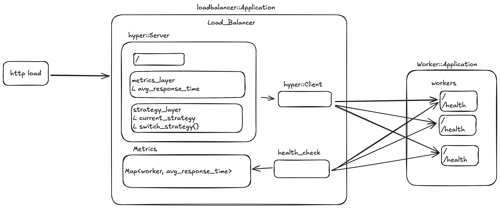

# Trailblazer

A high-performance distributed load balancing system built with Rust.  
It is an experimental project to learn Rust.

## Overview

Trailblazer is a robust, asynchronous load balancing solution designed for high-throughput applications.  
Trailblazer can adapt load balancing strategies
- round-robin distribution 
- routing based on real-time metrics e.g., average response time.  

The project consists of two main parts:

- **Load Balancer**: Distributes incoming requests across multiple worker instances
- **Worker**: Handles the actual processing of requests


## Features

- **High Performance**: Built with Rust for maximum performance and memory safety
- **Adaptive Load Balancing**: Round-robin and metric-based routing strategies
- **Real-time Metrics**: Tracks average response time and performance indicators
- **Asynchronous Processing**: Utilizes Tokio for efficient async operations
- **HTTP/HTTPS Support**: Full HTTP protocol support with Hyper
- **Configuration Management**: Flexible configuration system
- **Error Handling**: Comprehensive error handling with color-eyre
- **Environment Support**: Easy environment configuration with dotenv

## Getting Started

### Prerequisites

- Rust 1.87.0 or later
- Cargo package manager

### Installation

1. Clone the repository:
```bash
git clone https://github.com/raywu-hk/trailblazer.git
cd trailblazer
```

### Running the System

1. Start the load balancer:
   ```bash
   cargo run --bin loadbalancer
   ```
2. Start worker instances:
   ```bash
   cargo run --bin worker
   ```
